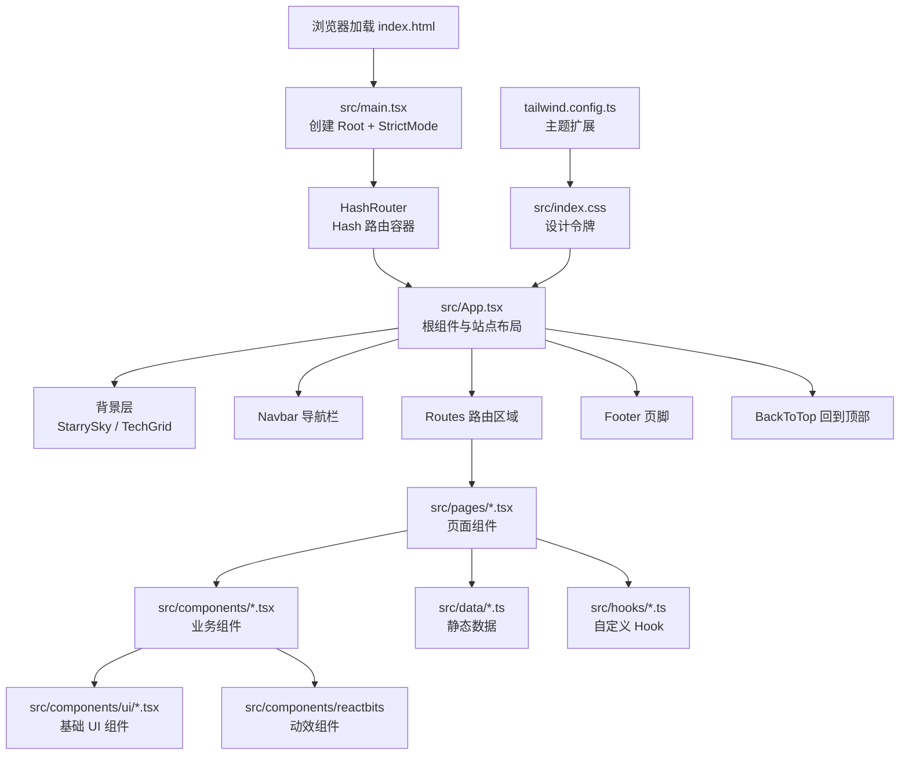
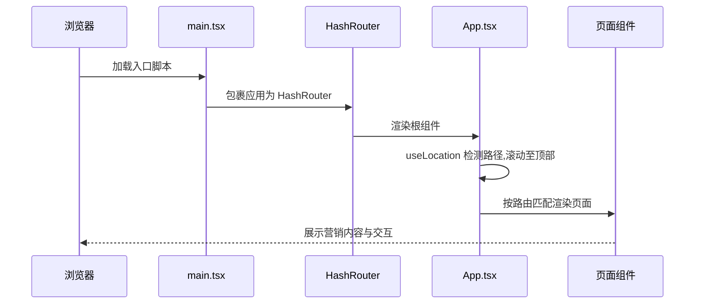
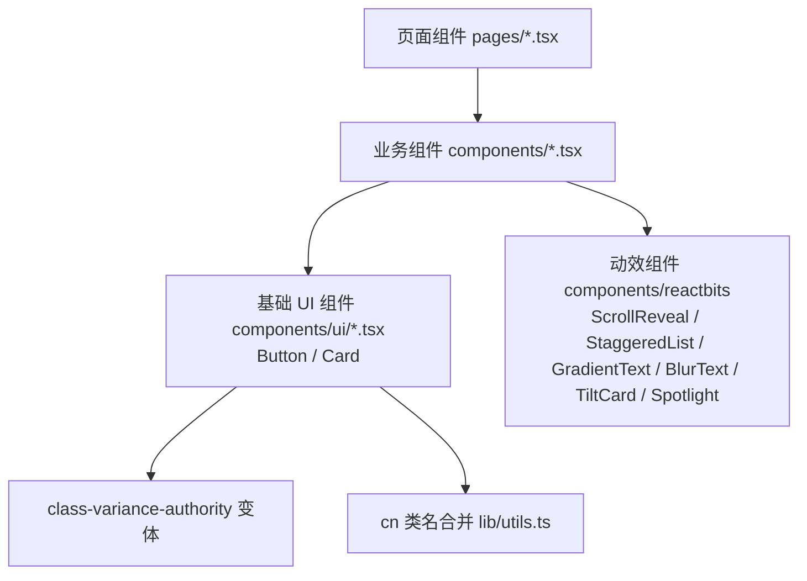
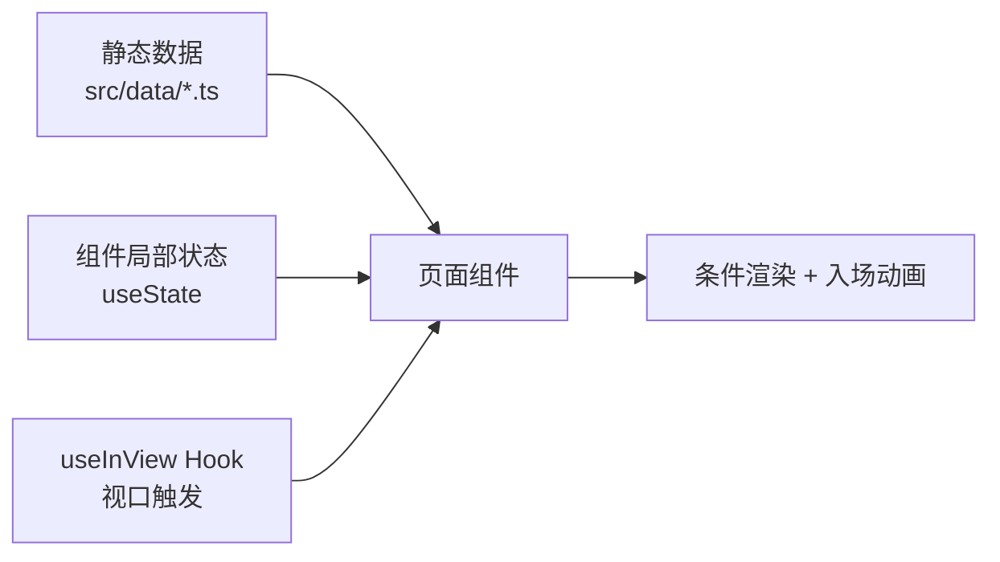
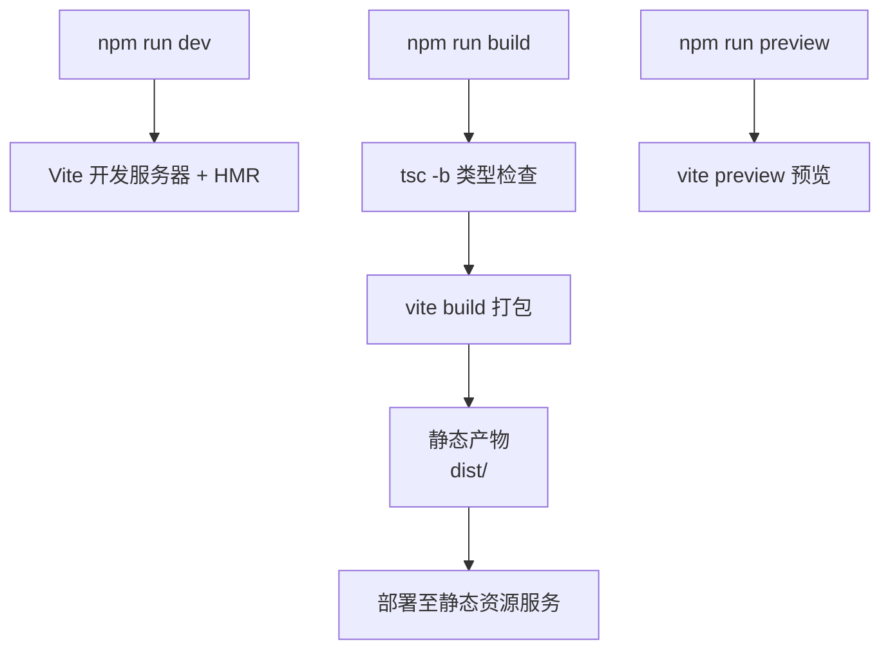

# 华腾·知渊官网 架构设计文档

> 本文档面向开发者,系统说明 `stars-www`(华腾·知渊官网)前端工程的技术选型、整体架构、目录结构、路由系统、组件层次、样式系统、数据流、构建部署与扩展指引。所有内容基于实际代码,引用真实文件路径与行号。

---

## 1. 文档目的与范围

本文档覆盖 `stars-www` 官网前端工程,基于 React 18 + TypeScript + Vite 构建的单页应用(SPA)。不涉及后端产品服务(如演示入口背后的 chat 服务)。文档旨在帮助开发者快速理解架构并高效迭代,不包含未实现能力的规划性描述。

关键文件:`package.json`、`vite.config.ts`、`tailwind.config.ts`、`src/main.tsx`、`src/App.tsx`。

---

## 2. 技术栈选型

来源:[`package.json`](../package.json)。

| 类别 | 选型 | 版本 | 选型理由 |
| --- | --- | --- | --- |
| 前端框架 | React + react-dom | ^18.3.1 | 成熟生态,支持并发特性与 StrictMode 开发期质量保障 |
| 路由 | react-router-dom | ^7.1.1 | 声明式路由,HashRouter 适配纯静态部署 |
| 类型系统 | TypeScript | ~5.6.2 | 严格模式提升类型安全,与 Vite 协同 |
| 构建工具 | Vite + @vitejs/plugin-react | ^6.0.5 | 原生 ESM、快速 HMR、按需编译 |
| 样式 | Tailwind CSS + tailwindcss-animate | ^3.4.17 | 原子化样式、按需生成、设计令牌扩展 |
| CSS 后处理 | postcss + autoprefixer | ^8.4.49 / ^10.4.20 | 厂商前缀自动补全 |
| 图标 | lucide-react | ^0.468.0 | 矢量图标按需引入 |
| 样式工具 | class-variance-authority + clsx + tailwind-merge | — | CVA 变体、类名合并去重 |
| 容器/编排 | pnpm/npm | — | 标准包管理 |

构建脚本:`dev`(Vite 开发服务器)、`build`(`tsc -b && vite build`)、`test`(node 原生测试)、`preview`(本地预览产物)。

---

## 3. 整体架构

应用为纯前端 SPA,使用 HashRouter 实现客户端路由,无需服务端路由配置,产物可部署于任意静态资源服务。



**端到端加载流程**:



入口:[`src/main.tsx`](../src/main.tsx) 使用 `createRoot` 渲染,`React.StrictMode` 包裹,`HashRouter` 提供路由能力,并引入全局样式 `index.css`。

---

## 4. 目录结构

`src/` 采用功能域组织方式:

```
src/
├── main.tsx                 # 应用入口:Root + StrictMode + HashRouter
├── App.tsx                   # 根组件:站点布局 + 路由表 + 背景层
├── index.css                 # 全局样式:设计令牌(HSL 变量)+ 通用类
├── vite-env.d.ts             # Vite 类型声明
├── components/               # 业务与基础组件
│   ├── ui/                   # 基础 UI 组件(Button、Card,CVA 变体)
│   ├── reactbits/            # 动效组件(ScrollReveal、StaggeredList 等)
│   ├── Hero.tsx              # 首页英雄区
│   ├── Capabilities.tsx      # 能力矩阵(标签页切换)
│   ├── Values.tsx            # 产品价值
│   ├── Navbar.tsx            # 导航栏(滚动进度 + 锚点)
│   ├── Footer.tsx            # 页脚
│   ├── SubpageLayout.tsx     # 子页面统一布局
│   ├── StarrySky.tsx         # 星空背景(首页)
│   ├── TechGrid.tsx          # 网格背景(子页面)
│   ├── ParticleGrid.tsx     # 粒子网格
│   └── ...                   # CTA、PainPoints、Customers 等
├── pages/                    # 页面组件(按业务域)
│   ├── KnowledgeBasePage.tsx
│   ├── SmartQAPage.tsx
│   ├── ResearchAgentPage.tsx
│   ├── WhitepaperPage.tsx
│   ├── DeployGuidePage.tsx
│   ├── BlogPage.tsx / BlogDetailPage.tsx
│   ├── FAQPage.tsx
│   ├── AboutPage.tsx / PartnersPage.tsx / ContactPage.tsx / PrivacyPage.tsx
├── data/                     # 静态数据
│   └── blogPosts.ts          # 博客文章元数据
├── hooks/                    # 自定义 Hook
│   └── useInView.ts          # 视口可见性检测
└── lib/                      # 工具函数
    └── utils.ts              # cn 类名合并
```

配置文件位于根目录:`vite.config.ts`、`tailwind.config.ts`、`postcss.config.js`、`tsconfig.json`、`tsconfig.app.json`。

---

## 5. 路由系统

### 5.1 选型:HashRouter

采用 HashRouter(而非 BrowserRouter),路由通过 URL hash(`#/path`)实现。优势:**纯静态部署无需服务端配置**,任何静态资源服务(含子目录部署)均可直接运行,刷新不会 404。代价:URL 含 `#`,不适合 SEO 要求高的场景——对本营销展示站可接受。

入口包裹见 [`src/main.tsx`](../src/main.tsx#L9-L11)。

### 5.2 路由表

根组件集中声明 12 条路由。来源:[`src/App.tsx`](../src/App.tsx#L132-L146)。

| 路径 | 组件 | 分类 |
| --- | --- | --- |
| `/` | HomePage(组合多个区块组件) | 首页 |
| `/whitepaper` | WhitepaperPage | 资源 |
| `/deploy-guide` | DeployGuidePage | 资源 |
| `/blog` | BlogPage | 资源 |
| `/blog/:slug` | BlogDetailPage | 资源(动态参数) |
| `/faq` | FAQPage | 资源 |
| `/about` | AboutPage | 公司 |
| `/partners` | PartnersPage | 公司 |
| `/contact` | ContactPage | 公司 |
| `/privacy` | PrivacyPage | 公司 |
| `/knowledge-base` | KnowledgeBasePage | 产品 |
| `/smart-qa` | SmartQAPage | 产品 |
| `/research-agent` | ResearchAgentPage | 产品 |

### 5.3 ScrollToTop 机制

[`App.tsx`](../src/App.tsx#L28-L34) 内定义 `ScrollToTop` 组件,监听 `useLocation().pathname` 变化,路由切换时 `window.scrollTo(0, 0)`,保证页面切换从顶部开始。

---

## 6. 组件层次

组件按职责分三层:



### 6.1 基础 UI 组件(`components/ui/`)

- **Button**(见 [`button.tsx`](../src/components/ui/button.tsx)):基于 `class-variance-authority` 的 `cva` 定义变体与尺寸,经 `cn` 合并类名。变体包括 default、destructive、outline、secondary、ghost、link、hero、hero-outline;尺寸包括 default、sm、lg、xl、icon。使用 `React.forwardRef` 转发 ref,`hero` 变体内置流光扫过效果。
- **Card**:基于 `forwardRef` 封装卡片容器、标题、描述、头部、内容与底部区域,统一边框、背景与阴影。

### 6.2 业务组件(`components/`)

首页区块组件:`Hero`、`PainPoints`、`Capabilities`、`Values`、`Customers`、`CTA`,由 `HomePage` 组合。`Capabilities` 内部使用 `useState` 管理标签页切换与指示器位置计算(见 [`Capabilities.tsx`](../src/components/Capabilities.tsx#L82-L107))。

### 6.3 动效组件(`components/reactbits/`)

提供滚动揭示与文本动效:`ScrollReveal`、`StaggeredList`、`GradientText`、`BlurText`、`TiltCard`、`Spotlight`,配合 `useInView` 与 CSS 动画实现入场效果。

---

## 7. 布局与全局结构

### 7.1 App 根组件

[`App.tsx`](../src/App.tsx#L106-L152) 负责站点级布局:

- **背景层**:根据当前路径判断使用 `HomeBackdrop`(StarrySky 星空,首页与产品/资源/公司页)还是 `TechGrid`(网格,其余页面),见 `starryPages` 列表判断。
- **ScrollToTop**:路由切换滚动重置。
- **Navbar**:固定导航栏。
- **main**:路由区域,`z-[1]` 保证内容层在背景之上。
- **Footer**:四列式页脚。
- **BackToTop**:回到顶部按钮。

### 7.2 子页面统一布局

[`SubpageLayout.tsx`](../src/components/SubpageLayout.tsx) 提供内容页面统一结构:返回首页链接 → 标题 + 副标题 → 内容区 → 底部 CTA("需要了解更多?")。配套 `ContentSection` 组件提供带边框与背景的内容分块。博客、白皮书、部署指南等内容页复用此布局。

---

## 8. 样式与设计系统

### 8.1 设计令牌(HSL CSS 变量)

[`src/index.css`](../src/index.css#L12-L63) 在 `:root` 定义深空主题令牌,采用 HSL 格式:

- 基础语义色:background、foreground、card、popover、primary、secondary、muted、accent、destructive、border、input、ring、radius
- 扩展令牌:accent-primary、accent-secondary、accent-glow、accent-surface、accent-border、surface-elevated
- 渐变:gradient-hero、gradient-primary、gradient-accent、gradient-card、gradient-text
- 阴影:shadow-glow、shadow-card

`@layer utilities` 暴露 `.gradient-*`、`.shadow-*`、`.glass`(玻璃态)、`.glass-border`、动画延迟类等工具类。

### 8.2 Tailwind 主题扩展

[`tailwind.config.ts`](../tailwind.config.ts) 关键配置:

- `darkMode: ["class"]`:通过类名切换暗色模式。
- `content`:扫描 `index.html` 与 `src/**/*.{ts,tsx}`,按需生成样式。
- `container`:居中、`2xl` 至 1400px。
- 扩展 `colors`(映射 CSS 变量)、`borderRadius`(基于 `--radius`)、`spacing`(13/18/22)、`transitionTimingFunction`(expo-out)、`boxShadow`(hero/card-glow 等)。
- **动画系统**:自定义 keyframes——`float`、`pulse-glow`、`fade-up`、`fade-in`、`slide-in-left`、`tab-fade-in`、`gradient-flow`、`shimmer`、`border-rotate`、`accordion-down/up`,对应 `animation` 配置统一动效风格。
- 插件:`tailwindcss-animate`。

### 8.3 类名合并工具

[`src/lib/utils.ts`](../src/lib/utils.ts) 的 `cn` 函数整合 `clsx`(条件类名)与 `tailwind-merge`(去重冲突),所有组件经此合并默认类名与外部传入类名,避免样式冲突。

字体:`Inter`、`Noto Sans SC`、`system-ui`。

---

## 9. 数据流

官网为纯前端展示站,**无后端 API 调用、无全局状态库**,数据流向简单:



- **静态数据**:如 [`src/data/blogPosts.ts`](../src/data/blogPosts.ts) 提供博客文章元数据与标签颜色映射,博客列表与详情页直接消费。
- **组件局部状态**:如 `Capabilities` 用 `useState` 管理 `activeTab`、`animKey`、`tabIndex`、`indicator`(指示器位置),通过 `useEffect` 计算标签指示器位移。
- **视口触发**:`useInView` Hook 检测元素进入视口,触发动画类名切换。

无 Redux/Zustand/Context 全局状态;路由状态由 react-router 管理。

---

## 10. 动效系统

- **useInView Hook**([`src/hooks/useInView.ts`](../src/hooks/useInView.ts)):基于 `IntersectionObserver`,默认阈值 0.15,元素进入视口后 `setIsInView(true)` 并 `unobserve`(只触发一次),组件卸载时 `disconnect` 清理。配合条件类名实现入场动画。
- **CSS keyframes**:`float`(浮动)、`pulse-glow`(脉冲发光)、`fade-up`(上移淡入)、`slide-in-left`(左滑入场)、`tab-fade-in`(标签内容入场)、`gradient-flow`(渐变流动)、`shimmer`(微光扫过)等,集中在 tailwind.config.ts。
- **reactbits 组件**:`ScrollReveal`、`StaggeredList`(错峰入场)等封装滚动揭示与序列动效。
- **性能考量**:入场动画仅在元素进入视口时触发,降低初始渲染压力;导航栏滚动监听为被动事件。

---

## 11. 构建与部署

### 11.1 构建配置

[`vite.config.ts`](../vite.config.ts):

- 插件:`@vitejs/plugin-react`(自动 JSX 转换与 HMR)。
- `base: './'`:相对基础路径,支持子目录部署。
- `build.cssCodeSplit: false`:CSS 不拆分,合并为单文件。
- `resolve.alias`:`@` 指向 `/src`,便于跨目录引用。

### 11.2 构建流程

`npm run build` 先执行 `tsc -b`(TypeScript 项目引用编译,类型检查),再执行 `vite build`(打包)。`npm run preview` 本地预览构建产物。



### 11.3 部署方式

产物为纯静态文件(`dist/`),因使用 HashRouter,无需服务端配置路由重写,可直接部署至任意静态资源服务或子目录。`base: './'` 保证资源路径相对,适配子路径部署场景。

---

## 12. 性能与可访问性

- **路由按需渲染**:react-router 仅渲染匹配路由对应组件,减少不必要重渲染。
- **样式按需生成**:Tailwind content 扫描仅生成实际使用的类,结合 CSS 变量减少冗余。
- **IntersectionObserver**:入场动画仅在元素进入视口时触发,降低初始渲染压力。
- **图标按需引入**:lucide-react 按需打包,降低体积。
- **可访问性**:默认面向 WCAG AA,正文与按钮保持足够对比度;关键内容在 `reduced motion` 下仍可见;移动端优先保证导航、CTA、卡片文字与图像不重叠。
- **移动端适配**:Tailwind 响应式断点(`sm`/`lg`),导航栏含移动端菜单。

---

## 13. 扩展指引

### 新增页面

1. 在 `src/pages/` 新建页面组件,内容型页面可复用 `SubpageLayout` + `ContentSection`。
2. 在 [`src/App.tsx`](../src/App.tsx) 路由表新增 `<Route>`。
3. 如需星空背景,将路径加入 `starryPages` 列表;否则默认使用 `TechGrid`。
4. 在 `Navbar` 与 `Footer` 导航中按需加入入口。

### 新增业务组件

1. 在 `src/components/` 新建组件,使用 `cn` 合并类名。
2. 复用 `components/ui/` 的 Button/Card 与 `reactbits` 动效组件。
3. 需入场动画时使用 `useInView` Hook 或 `ScrollReveal`。

### 新增/调整样式

1. 颜色与令牌:修改 `src/index.css` 的 `:root` 变量(保持 HSL 格式)。
2. 主题扩展(动画、间距、阴影):修改 `tailwind.config.ts` 的 `extend`。
3. 组件类名:经 `cn` 合并,避免与 Tailwind 原子类冲突。

### 新增静态数据

1. 在 `src/data/` 新建数据模块,导出类型化数据。
2. 页面组件直接 import 消费。

---

## 附:关键文件索引

| 关注点 | 文件 |
| --- | --- |
| 入口与路由容器 | [`src/main.tsx`](../src/main.tsx) |
| 根组件与路由表 | [`src/App.tsx`](../src/App.tsx) |
| 全局样式与令牌 | [`src/index.css`](../src/index.css) |
| Tailwind 主题 | [`tailwind.config.ts`](../tailwind.config.ts) |
| 构建配置 | [`vite.config.ts`](../vite.config.ts) |
| 依赖与脚本 | [`package.json`](../package.json) |
| 类名工具 | [`src/lib/utils.ts`](../src/lib/utils.ts) |
| 视口 Hook | [`src/hooks/useInView.ts`](../src/hooks/useInView.ts) |
| 基础 UI | [`src/components/ui/button.tsx`](../src/components/ui/button.tsx)、`src/components/ui/card.tsx` |
| 子页面布局 | [`src/components/SubpageLayout.tsx`](../src/components/SubpageLayout.tsx) |
