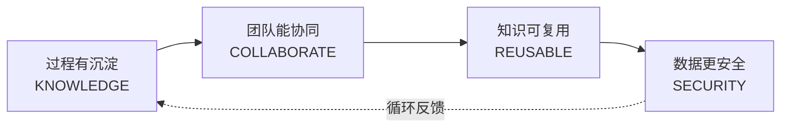
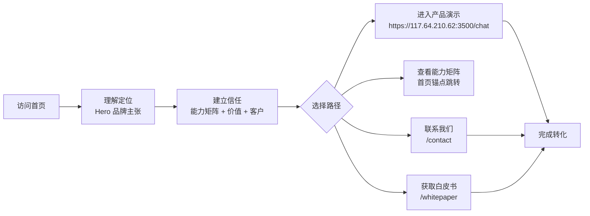

# 华腾·知渊 产品文档

> 本文档面向产品、业务与决策者,系统说明华腾·知渊官网所承载的产品定位、目标用户、能力矩阵、价值主张与信息架构。所有能力项均来自官网实际源码,未杜撰未实现的功能。

---

## 1. 产品概览

| 项目 | 说明 |
| --- | --- |
| 产品名称 | 华腾·知渊（Huateng Zhiyuan） |
| 一句话定位 | 国内面向团队的知识智能体平台 |
| 核心理念 | 让团队知识,成为可调用的智能能力 |
| 信任标签 | 本地私有化 · 全链路可追溯 · 组织级权限 |
| 关键指标 | 132 个科研 Skill · 4 大能力域 · 100% 数据本地化 |
| 演示入口 | `https://117.64.210.62:3500/chat`(见 [`Hero.tsx`](../src/components/Hero.tsx)) |

华腾·知渊是一套面向团队全场景需求的 AI Agent 平台,将资料解析、知识沉淀、科研问答、项目协同与写作总结连接起来,让团队经验从分散文件变成可检索、可推理、可复用的智能能力。官网作为营销展示型单页应用(SPA),其职责是:让访问者迅速理解平台定位、相信工程落地能力,并愿意进入演示或进一步沟通。

品牌人格关键词:深空、可信、工程化。整体语气有探索感但不过度炫技,强调可靠、清晰、可部署和可追溯。

---

## 2. 目标用户与场景

### 2.1 目标用户

科研团队、企业或机构技术负责人,以及需要私有化 AI 知识管理与 Agent 能力的组织决策者。他们通常在评估团队知识沉淀、科研协同、私有化部署和数据安全方案,需要快速判断平台是否可信、是否适合复杂组织落地。

### 2.2 典型使用场景

- **课题组知识管理**:论文、数据、会议纪要统一进入团队知识空间,人员更替不带走组织经验。
- **科研问答与综述**:基于真实文献的可信问答,回答附带引用来源,降低幻觉风险。
- **科研自动化**:批量论文摘要、周报自动生成、领域前沿订阅、政策采集等 7×24 自动运行。
- **协同写作**:从素材采集到框架构建、正文撰写、审稿修改,多智能体分工协作完成论文写作。
- **安全合规场景**:本地部署、项目级隔离、全程审计,满足敏感资料的私有化要求。

---

## 3. 核心能力矩阵

四大能力域覆盖团队知识全生命周期,从信息进入组织的那一刻,到协同使用、经验复用和安全治理,每个环节都在同一平台内连续运行。来源:[`Capabilities.tsx`](../src/components/Capabilities.tsx)。

### 3.1 过程有沉淀(KNOWLEDGE)

多源输入、深度解析、知识资产化。

| 子能力 | 说明 |
| --- | --- |
| 多源知识接入 | 论文、表格、图片、音视频、网页与业务系统统一进入团队知识空间。 |
| 深度解析能力 | 识别章节、图表、公式和引用关系,保留文档内部逻辑。 |
| 知识资产化 | 串联原始素材、任务过程与最终成果,形成可复用记忆链。 |

### 3.2 团队能协同(COLLABORATE)

共享上下文、方法固化、全链路协作。

| 子能力 | 说明 |
| --- | --- |
| 共享项目上下文 | 成员在同一项目空间使用同一份知识,接手任务无需从零开始。 |
| 方法论固化 | 将团队工作方法沉淀为可调用 Skill,稳定复制专家经验。 |
| 全局链路覆盖 | 132 个科研 Skill 覆盖从选题、实验到写作与汇报。 |

### 3.3 知识可复用(REUSABLE)

可信问答、任务即经验、长期记忆。

| 子能力 | 说明 |
| --- | --- |
| 可信问答 | 回答附带真实来源引用,帮助团队核验结论并降低幻觉风险。 |
| 任务即经验 | 项目历史成为下一次任务的起点,人员变化不再造成知识断层。 |
| 组织记忆体系 | 短期记忆保持任务连续,长期记忆让团队经验持续积累。 |

### 3.4 数据更安全(SECURITY)

本地部署、项目隔离、审计追踪。

| 子能力 | 说明 |
| --- | --- |
| 安全策略 | 支持本地部署与项目级隔离,数据不参与外部模型训练。 |
| 全程可审计 | 权限、调用与输出留有日志记录,关键操作可查询和追踪。 |
| 数据主权 | 组织自行控制数据、模型与访问边界,满足敏感场景要求。 |

---

## 4. 产品价值主张

价值不只体现在一次回答更快,而在于团队知识能够留下来、连起来、用起来,并始终处于组织可控范围内。来源:[`Values.tsx`](../src/components/Values.tsx)。

| 价值 | 关键词 | 说明 |
| --- | --- | --- |
| 经验持续沉淀 | 不丢失 | 研究路径、判断依据与工作方法随任务完整留存,人员变化不再带走组织经验。 |
| 知识结构清晰 | 可调用 | 资料、会议与成果按项目和关系组织,检索、引用和复用都更直接。 |
| 协作上下文一致 | 可协同 | 成员围绕同一任务共享知识与进展,新人接手无需重新拼接背景。 |
| 数据边界可控 | 可治理 | 私有化部署、分级权限与审计机制共同保障敏感资料和模型调用。 |

---

## 5. 重点产品页能力说明

官网设有三大产品能力页,分别承载知识库、智能问答与科研智能体矩阵的详细能力展示。

### 5.1 智能知识库(`/knowledge-base`)

为每个科研者与课题组提供独立、安全、智能的知识管理空间,支持多种文档格式上传,内置论文阅读、分析、总结能力,让知识真正流动起来。来源:[`KnowledgeBasePage.tsx`](../src/pages/KnowledgeBasePage.tsx)。

**知识库分类体系**

- **个人知识库**:每位科研人员注册后自动获得 5 个固定个人知识库,仅本人可见,用于沉淀个人科研经验。
  - 个人总结、知识订阅、收藏对话、个人笔记、默认知识库
- **课题组知识库**:课题组负责人可自由创建多个知识库,灵活分配成员权限,实现团队知识的统一沉淀与高效协作。

**支持文档格式**:PDF/Word、Excel/CSV、图片、代码文件、视频/音频、压缩包、数据集、Markdown。

**权限与安全**

| 能力 | 说明 |
| --- | --- |
| 知识库级别隔离 | 每个知识库独立存储与索引,数据完全隔离,互不干扰。 |
| 精细权限控制 | 支持「只读」「可编辑」「管理员」三级权限,灵活分配。 |
| 成员管理 | 课题组负责人可管理成员加入与离开,权限实时生效。 |
| 操作审计日志 | 所有文档操作均可追溯,谁上传、谁查看、谁删除一目了然。 |

**论文智能能力**:智能检索、论文阅读、论文分析、论文总结、论文问答、研究趋势。

### 5.2 智能问答(`/smart-qa`)

支持单智能体精准问答与多智能体协同分析(A2A)两种对话模式。来源:[`SmartQAPage.tsx`](../src/pages/SmartQAPage.tsx)。

**单智能体模式**

| 能力 | 说明 |
| --- | --- |
| 上下文感知对话 | AI 自动理解对话历史与研究背景,每一轮回答都基于完整上下文,无需重复说明。 |
| 知识库深度关联 | 对话自动关联个人与课题组知识库,回答基于真实文献数据,杜绝 AI 幻觉。 |
| 多轮深度追问 | 支持连续追问与话题深入,AI 保持对话连贯性,像与真正的科研伙伴交流。 |
| 引用溯源追踪 | 每条回答标注引用来源,点击即可跳转原文,确保信息可信可验证。 |

**多智能体协同(A2A)**

一次提问由多个专家 Agent 分别分析,覆盖科研全链条:

| Agent | 职责 |
| --- | --- |
| 文献综述 Agent | 检索并综合相关文献 |
| 数据分析 Agent | 统计分析与数据解读 |
| 方法论 Agent | 研究方法评估与建议 |
| 实验设计 Agent | 实验方案设计与优化 |
| 学术写作 Agent | 论文结构与表达优化 |

**协同价值**:多视角分析(避免单一视角盲区)、交叉验证(结果相互印证,发现矛盾)、全面覆盖(文献→数据→方法→实验→写作一次覆盖)、冲突调解(自动标注争议点并给出综合建议)。

### 5.3 科研智能体矩阵(`/research-agent`)

一组专业智能体 7×24 小时自动运行,将重复性科研工作交给 AI,让你专注于真正的创新思考。来源:[`ResearchAgentPage.tsx`](../src/pages/ResearchAgentPage.tsx)。

**六大专业智能体**

| 智能体 | 标签 | 说明 |
| --- | --- | --- |
| 批量总结智能体 | 效率提升 | 自动批量提取论文摘要、生成思维导图,将零散文献转化为结构化知识卡片。 |
| 周报生成智能体 | 自动化 | 自动汇总个人本周科研进展、阅读笔记与对话记录,一键生成结构化周报。 |
| 知识订阅智能体 | 智能推送 | 持续追踪关注领域最新论文与研究动态,每日定时推送高相关度内容。 |
| 政策采集智能体 | RPA 采集 | RPA 智能抓取行业政策、基金申报、学术会议等信息,自动分类归档。 |
| 协同写作智能体 | 协同写作 | 从素材采集到框架构建、正文撰写、审稿修改,全流程 AI 协作完成论文写作。 |
| 知识匹配智能体 | 知识找人 | 基于研究方向与阅读历史,智能匹配并推荐最相关的文献、数据与合作者。 |

**核心优势**:全自动执行、精准个性化、多体协同、灵活可配置。

**协同写作流程**:素材采集 → 框架构建 → 正文撰写 → 审稿修改,多 Agent 分工协作。

---

## 6. 安全与私有化

安全与私有化是华腾·知渊的核心信任支柱,贯穿四大能力域中的"数据更安全"域:

- **本地部署**:支持本地私有化部署,数据不参与外部模型训练。
- **项目级隔离**:每个知识库独立存储与索引,数据完全隔离。
- **全程可审计**:权限、调用与输出留有日志,关键操作可查询追踪。
- **数据主权**:组织自行控制数据、模型与访问边界,满足敏感场景要求。
- **分级权限**:知识库级「只读/可编辑/管理员」三级权限,成员管理实时生效。

---

## 7. 官网信息架构

官网采用单页应用(SPA)+ Hash 路由,共 13 条路由(含博客列表与详情),分为首页、产品页、资源页与公司页四类。来源:[`App.tsx`](../src/App.tsx)。

```mermaid
graph TD
    Root[华腾·知渊官网] --> Home[首页 /]
    Root --> Product[产品页]
    Root --> Resource[资源页]
    Root --> Company[公司页]

    Home --> H1[Hero 英雄区]
    Home --> H2[PainPoints 痛点]
    Home --> H3[Capabilities 能力矩阵]
    Home --> H4[Values 产品价值]
    Home --> H5[Customers 客户]
    Home --> H6[CTA 行动号召]

    Product --> P1[知识库 /knowledge-base]
    Product --> P2[智能问答 /smart-qa]
    Product --> P3[科研智能体 /research-agent]

    Resource --> R1[白皮书 /whitepaper]
    Resource --> R2[部署指南 /deploy-guide]
    Resource --> R3[博客 /blog + /blog/:slug]
    Resource --> R4[FAQ /faq]

    Company --> C1[关于我们 /about]
    Company --> C2[合作伙伴 /partners]
    Company --> C3[联系我们 /contact]
    Company --> C4[隐私政策 /privacy]
```

**首页叙事结构**:Hero(品牌与核心价值)→ PainPoints(痛点)→ Capabilities(能力矩阵)→ Values(产品价值)→ Customers(客户)→ CTA(行动号召),形成"认知—信任—转化"闭环。

---

## 8. 演示与转化路径

官网围绕"让访问者进入演示或沟通"设计转化路径:

首页 Hero 区提供两个主入口:"进入产品演示"(直达演示环境)与"查看能力矩阵"(页内锚点滚动)。各子页面底部统一设有"需要了解更多?"CTA 区块(见 [`SubpageLayout.tsx`](../src/components/SubpageLayout.tsx)),引导联系与预约演示。

---

## 附:文档来源说明

本文档所有能力项、文案与数据均提取自官网源码,关键引用文件:

- [`src/components/Hero.tsx`](../src/components/Hero.tsx) — 品牌主张与关键指标
- [`src/components/Capabilities.tsx`](../src/components/Capabilities.tsx) — 四大能力域
- [`src/components/Values.tsx`](../src/components/Values.tsx) — 产品价值
- [`src/pages/SmartQAPage.tsx`](../src/pages/SmartQAPage.tsx) — 智能问答能力
- [`src/pages/ResearchAgentPage.tsx`](../src/pages/ResearchAgentPage.tsx) — 科研智能体矩阵
- [`src/pages/KnowledgeBasePage.tsx`](../src/pages/KnowledgeBasePage.tsx) — 知识库能力
- [`src/App.tsx`](../src/App.tsx) — 路由与信息架构
